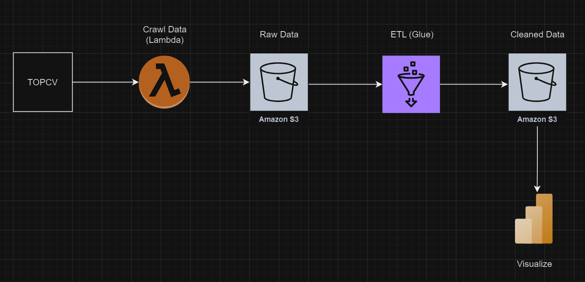

Kiến trúc:
- Tạo AWS Lambda Function, sử dụng selenium để crawl dữ liệu việc IT làm từ TOPCV và lưu vào AWS S3 dưới dạng file JSON
- Tạo Glue Job xử lý lại dữ liệu (loại bỏ thẻ html trong crawl data, lấy thông tin tỉnh thành phố,...)
- Sử dụng BI tools để visualize dữ liệu
